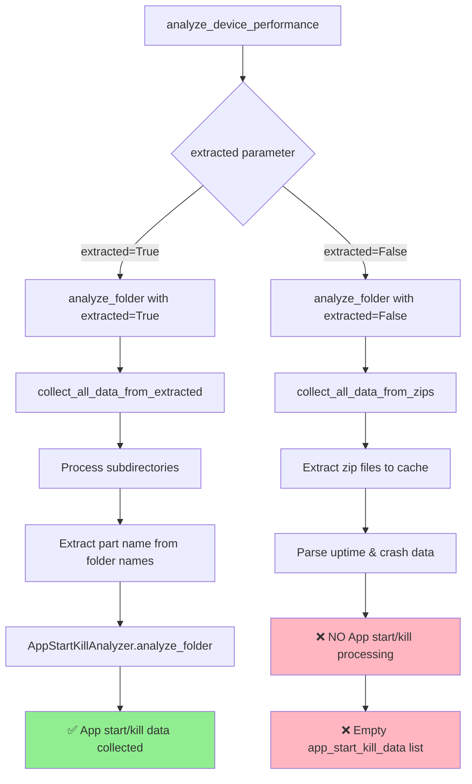
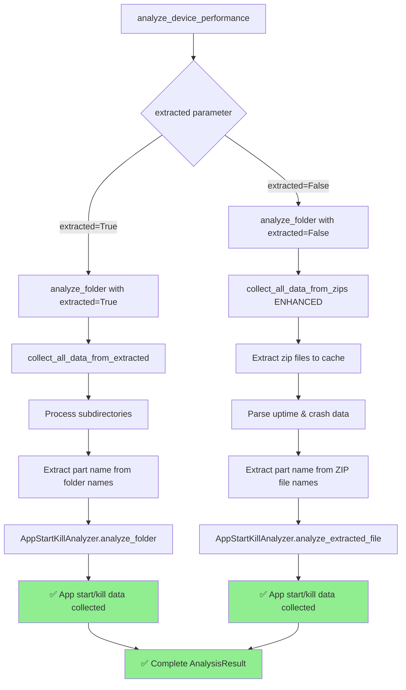

# App Start/Kill Analysis Flow Analysis

## Problem Statement
Sheet `App_Start_Kill_Analysis` được tạo nhưng không có data được ghi vào khi xử lý zip files (`extracted=False`).

## Flow Hiện Tại (Có Vấn Đề)

### 1. Main Entry Point
```python
analyze_device_performance(dut, ref, extracted=False)
    ↓
DeviceComparator(dut, ref, config, extracted)  # Đã sửa
    ↓
comparator.compare()
    ↓
dut.analyze(extracted=extracted)  # extracted=False
    ↓
analyze_folder(folder, extracted=False)
```

### 2. Flow Chi Tiết Hiện Tại



### 3. Code Issues Hiện Tại

#### Issue 1: analyze_folder() - Chỉ xử lý app start/kill khi extracted=True
```python
def analyze_folder(self, folder: Path, extracted: bool = False) -> AnalysisResult:
    # ...
    if extracted:
        uptime_data, crash_data = self.collect_all_data_from_extracted(folder)
        
        # Analyze app start/kill events
        app_start_kill_data = []
        if extracted:  # ❌ CHỈ KHI EXTRACTED = TRUE
            app_analyzer = AppStartKillAnalyzer()
            # ... logic thu thập data
    else:
        uptime_data, crash_data = self.collect_all_data_from_zips(folder)
        # ❌ THIẾU: Không có logic app start/kill cho zip files
```

#### Issue 2: collect_all_data_from_zips() - Thiếu app start/kill processing
```python
def collect_all_data_from_zips(self, folder: Path) -> Tuple[List[UptimeData], List[CrashData]]:
    """Collect all data (uptime and crashes) from zip files in a single pass per file"""
    uptime_data = []
    crash_data = []
    
    # Extract all zip files first
    zip_to_extracted = self.extract_all_zips(folder)
    
    # Then process all extracted files
    for zip_file, dump_path in zip_to_extracted.items():
        # Parse all content in a single pass directly
        uptime_result, io_read_data, io_write_data, file_crash_data = self.parse_file_content(dump_path)
        
        # Extract part name from zip file name
        part_name = self._extract_part_name(zip_file.name)
        
        # ❌ THIẾU: Không xử lý app start/kill data
        
    return uptime_data, crash_data  # ❌ THIẾU app_start_kill_data
```

#### Issue 3: AppStartKillAnalyzer - Chỉ làm việc với folder paths
```python
def analyze_folder(self, folder_path: Path, part_name: str) -> List[AppStartKillInfo]:
    """Analyze all dumpstate files in a folder for all apps corresponding to the part"""
    # Find the largest dumpstate file in the folder
    largest_file = self._find_largest_file(folder_path)  # ❌ Cần folder path
    
    # ❌ KHÔNG CÓ method để analyze single extracted file
```

## Flow Đề Xuất (Sửa Đổi)

### 1. Target Flow Mới



### 2. Changes Cần Thực Hiện

#### Change 1: Mở rộng collect_all_data_from_zips()
```python
def collect_all_data_from_zips(self, folder: Path) -> Tuple[List[UptimeData], List[CrashData], List[AppStartKillInfo]]:
    """Collect all data (uptime, crashes, and app start/kill) from zip files"""
    uptime_data = []
    crash_data = []
    app_start_kill_data = []  # ✅ THÊM
    
    # Extract all zip files first
    zip_to_extracted = self.extract_all_zips(folder)
    
    # Initialize app analyzer
    app_analyzer = AppStartKillAnalyzer()
    
    # Then process all extracted files
    for zip_file, dump_path in zip_to_extracted.items():
        # Extract part name from zip file name
        part_name = self._extract_part_name(zip_file.name)
        
        # Parse uptime & crash data (existing logic)
        uptime_result, io_read_data, io_write_data, file_crash_data = self.parse_file_content(dump_path)
        # ... existing uptime/crash processing ...
        
        # ✅ THÊM: Process app start/kill data
        if part_name:
            app_info_list = app_analyzer.analyze_extracted_file(dump_path, part_name)
            app_start_kill_data.extend(app_info_list)
    
    return uptime_data, crash_data, app_start_kill_data  # ✅ THÊM
```

#### Change 2: Cập nhật analyze_folder()
```python
def analyze_folder(self, folder: Path, extracted: bool = False) -> AnalysisResult:
    """Analyze a single folder and return structured results"""
    prefix = self.get_prefix(folder)
    
    if extracted:
        uptime_data, crash_data = self.collect_all_data_from_extracted(folder)
        
        # Analyze app start/kill events (existing logic)
        app_start_kill_data = []
        if extracted:
            app_analyzer = AppStartKillAnalyzer()
            # ... existing logic for extracted folders
    else:
        # ✅ CẬP NHẬT: Collect app start/kill data from zips
        uptime_data, crash_data, app_start_kill_data = self.collect_all_data_from_zips(folder)
    
    # ... rest of existing logic remains the same
```

#### Change 3: Thêm method mới vào AppStartKillAnalyzer
```python
def analyze_extracted_file(self, file_path: Path, part_name: str) -> List[AppStartKillInfo]:
    """Analyze a single extracted dumpstate file for all apps in a part"""
    # Find all apps corresponding to this part
    target_apps = []
    for app, part in FOLDER_APP_PART_MAPPING.items():
        if f"{part}part" == part_name:
            target_apps.append(app)
    
    if not target_apps:
        return []
    
    # Analyze the file for each app in this part
    app_infos = []
    for target_app in target_apps:
        app_info = self.analyze_file(file_path, target_app)
        # Set folder name to the original file name (not the cache file)
        app_info.folder_name = file_path.stem
        app_infos.append(app_info)
    
    return app_infos
```

## Implementation Plan

### Phase 1: Core Changes
1. **Modify collect_all_data_from_zips()**
   - Add app_start_kill_data parameter
   - Add AppStartKillAnalyzer initialization
   - Add app start/kill processing loop

2. **Update analyze_folder()**
   - Handle new return value from collect_all_data_from_zips()
   - Ensure app_start_kill_data is passed to AnalysisResult

3. **Add analyze_extracted_file() method**
   - New method in AppStartKillAnalyzer
   - Process single file instead of folder
   - Reuse existing analyze_file() logic

### Phase 2: Testing & Validation
1. **Unit Tests**
   - Test part name extraction from zip files
   - Test app start/kill analysis from extracted files
   - Test complete flow with zip files

2. **Integration Tests**
   - Test with real zip files
   - Verify Excel sheet population
   - Compare results with extracted folder approach

### Phase 3: Optimization (Optional)
1. **Performance Improvements**
   - Cache app analysis results
   - Optimize regex patterns
   - Add debug logging

2. **Error Handling**
   - Better error messages
   - Graceful fallbacks
   - Validation of extracted data

## Benefits of Proposed Solution

### 1. **No Manual Extraction Required**
- Users can work directly with zip files
- No need for manual folder creation
- Consistent workflow for both scenarios

### 2. **Reuses Existing Logic**
- Part name extraction already works with zip files
- AppStartKillAnalyzer core logic remains unchanged
- Minimal code changes required

### 3. **Performance Optimized**
- Single pass through extracted files
- No additional file I/O operations
- Efficient memory usage

### 4. **Consistent Behavior**
- Same results regardless of input format
- Unified processing pipeline
- Easier maintenance and debugging

## Risk Assessment

### Low Risk
- Changes are isolated to specific functions
- Existing functionality for extracted folders unchanged
- Backward compatibility maintained

### Medium Risk
- New method needs thorough testing
- Error handling for zip file processing
- Performance impact with large zip files

### Mitigation Strategies
- Comprehensive unit and integration tests
- Gradual rollout with fallback options
- Performance monitoring and optimization

## Conclusion

The proposed solution addresses the root cause by extending the existing zip file processing pipeline to include app start/kill analysis. This approach:

1. **Solves the immediate problem** - App start/kill data will be collected from zip files
2. **Maintains consistency** - Same logic and results as extracted folders
3. **Improves user experience** - No manual extraction required
4. **Minimizes risk** - Small, focused changes with existing patterns

The implementation is straightforward and leverages the existing infrastructure effectively.
