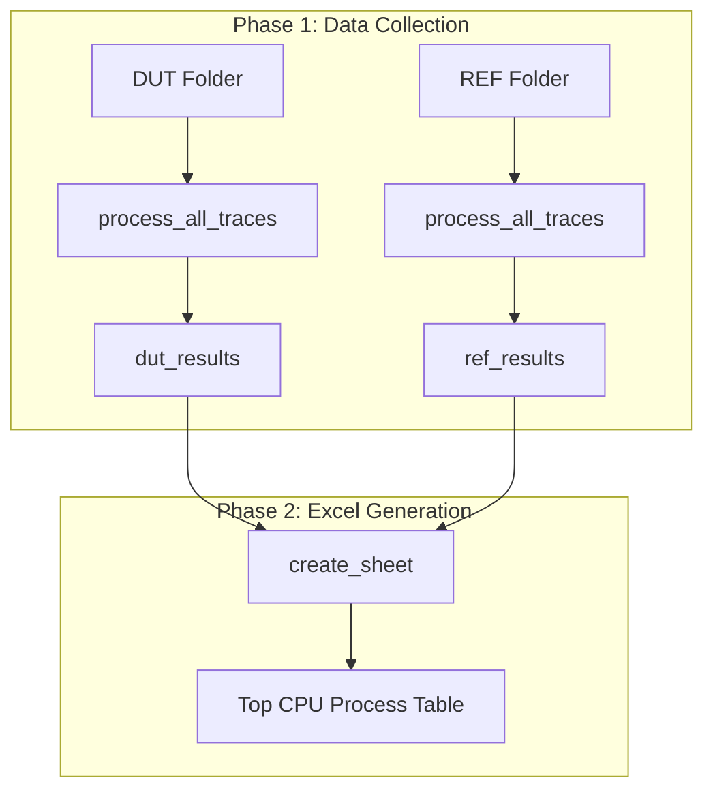
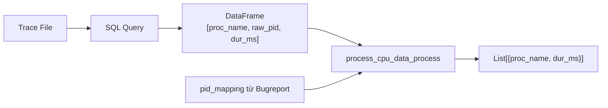
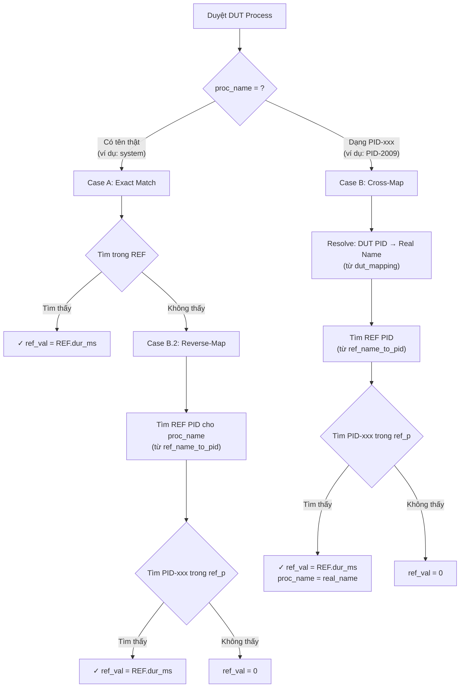

# Top CPU Process - Data Flow Documentation

## Tổng Quan Kiến Trúc



---

## Phase 1: Data Collection

### 1.1 Thu thập Bugreport Mappings

**File:** `dumpstate_parser.py`

```
DUT Folder/
├── A576_camera_1.log        (occurrence=1, Group 1)
├── A576_camera_2.log        (occurrence=2, Group 1)
├── A576_1part_Bugreport.zip (Group 1, Cycle 1)
├── A576_hello_1.log         (occurrence=1, Group 2)
├── ...
└── A576_6part_Bugreport.zip (Group 6, Cycle 1)
```

**Hàm `collect_bugreport_mappings(folder_path)`:**
```python
# Output: {
#   "path/A576_1part_Bugreport.zip": {2009: "com.android.systemui", 1006: "surfaceflinger", ...},
#   "path/A576_2part_Bugreport.zip": {3001: "com.google.dialer", ...},
#   ...
# }
```

### 1.2 Map Log File → Bugreport

**Hàm `get_bugreport_for_log(log_filename, bugreport_mappings, occurrence)`:**

| Log File | Occurrence | Cycle Index | App Group | Selected Bugreport |
|----------|------------|-------------|-----------|-------------------|
| `camera_1.log` | 1 | 0 | Group 1 | `1part_Bugreport.zip[0]` |
| `camera_2.log` | 2 | 0 | Group 1 | `1part_Bugreport.zip[0]` |
| `camera_3.log` | 3 | 1 | Group 1 | `1part_Bugreport.zip[1]` |
| `hello_1.log` | 1 | 0 | Group 2 | `2part_Bugreport.zip[0]` |

**Công thức:** `cycle_index = (occurrence - 1) // 2`

---

### 1.3 Process Trace với PID Mapping

**File:** `sql_query.py`



**Hàm `process_cpu_data_process(df, pid_mapping)`:**

```python
# Input DataFrame từ SQL:
# | proc_name | raw_pid | dur_ms |
# |-----------|---------|--------|
# | None      | 2009    | 100.5  |  ← Trace không có tên
# | system    | 1335    | 80.2   |  ← Trace có tên

# Với pid_mapping = {2009: "com.android.systemui", ...}

# Output:
# [
#   {"proc_name": "com.android.systemui", "dur_ms": 100.5},  ← Resolved từ PID
#   {"proc_name": "system", "dur_ms": 80.2}                  ← Giữ nguyên
# ]
```

> **Lưu ý:** Nếu không có `pid_mapping`, process giữ dạng `"PID-2009"`

---

### 1.4 Lưu PID_Mapping vào Metrics

**File:** `sql_query.py` - `analyze_trace()`

```python
metrics["CPU_Process_Data"] = process_cpu_data_process(cpu_proc_df, pid_mapping)
metrics["PID_Mapping"] = pid_mapping if pid_mapping else {}
# ↑ Lưu lại mapping để sử dụng trong cross-mapping ở Phase 2
```

---

## Phase 2: Excel Generation (Cross-Mapping)

### 2.1 Load Data cho mỗi Cycle

**File:** `execution_sql.py` - `create_sheet()`

```python
for cycle_idx in range(max_cycles):
    # Lấy CPU data
    dut_p = dut_cycles[cycle_idx].get("CPU_Process_Data", [])
    ref_p = ref_cycles[cycle_idx].get("CPU_Process_Data", [])
    
    # Lấy PID Mapping (để cross-mapping)
    dut_mapping = dut_cycles[cycle_idx].get("PID_Mapping", {})
    ref_mapping = ref_cycles[cycle_idx].get("PID_Mapping", {})
    
    # Tạo reverse mapping cho REF: {"process_name": PID}
    ref_name_to_pid = {name: pid for pid, name in ref_mapping.items()}
```

---

### 2.2 Cross-Mapping Algorithm



---

### 2.3 Ví dụ Chi Tiết

#### Scenario 1: Exact Match (Cả hai có tên thật giống nhau)

```
DUT Data: [{"proc_name": "system_server", "dur_ms": 150.0}]
REF Data: [{"proc_name": "system_server", "dur_ms": 120.0}]

Result: {"name": "system_server", "dut": 150.0, "ref": 120.0, "diff": +30.0}
```

#### Scenario 2: DUT có tên, REF có PID

```
DUT Data: [{"proc_name": "surfaceflinger", "dur_ms": 100.0}]
REF Data: [{"proc_name": "PID-4005", "dur_ms": 80.0}]
REF Mapping: {4005: "surfaceflinger"}
ref_name_to_pid: {"surfaceflinger": 4005}

Process:
1. Tìm "surfaceflinger" trong REF → Không thấy
2. Lookup "surfaceflinger" trong ref_name_to_pid → PID 4005
3. Tìm "PID-4005" trong ref_p → Tìm thấy! dur_ms = 80.0

Result: {"name": "surfaceflinger", "dut": 100.0, "ref": 80.0, "diff": +20.0}
```

#### Scenario 3: DUT có PID, REF có tên

```
DUT Data: [{"proc_name": "PID-2009", "dur_ms": 100.0}]
DUT Mapping: {2009: "com.android.systemui"}
REF Data: [{"proc_name": "com.android.systemui", "dur_ms": 80.0}]

Process:
1. DUT là "PID-2009" → Resolve từ dut_mapping → "com.android.systemui"
2. Tìm PID tương ứng trên REF → Không cần (REF đã có tên)
3. [Hoặc] Tìm "PID-xxx" trong ref_p → Không thấy
4. [Khi process REF data] Tìm thấy exact match

Result: {"name": "com.android.systemui", "dut": 100.0, "ref": 80.0, "diff": +20.0}
```

#### Scenario 4: Cả hai có PID khác nhau (cùng process)

```
DUT Data: [{"proc_name": "PID-2009", "dur_ms": 100.0}]
DUT Mapping: {2009: "com.samsung.honeyboard"}

REF Data: [{"proc_name": "PID-5001", "dur_ms": 85.0}]
REF Mapping: {5001: "com.samsung.honeyboard"}
ref_name_to_pid: {"com.samsung.honeyboard": 5001}

Process:
1. DUT "PID-2009" → dut_mapping → "com.samsung.honeyboard"
2. Lookup trong ref_name_to_pid → PID 5001
3. Tìm "PID-5001" trong ref_p → Tìm thấy! dur_ms = 85.0
4. Update proc_name = "com.samsung.honeyboard"

Result: {"name": "com.samsung.honeyboard", "dut": 100.0, "ref": 85.0, "diff": +15.0}
```

#### Scenario 5: Process chỉ có trên REF

```
DUT Data: []
REF Data: [{"proc_name": "logd", "dur_ms": 50.0}]

Process:
1. Loop REF data
2. "logd" không có trong merged_p
3. Add với dut=0.0

Result: {"name": "logd", "dut": 0.0, "ref": 50.0, "diff": -50.0}
```

---

### 2.4 Final Output

```python
# merged_p sau khi xử lý:
merged_p = {
    "system_server":          {"dut": 150.0, "ref": 120.0},
    "surfaceflinger":         {"dut": 100.0, "ref": 80.0},
    "com.android.systemui":   {"dut": 100.0, "ref": 80.0},
    "com.samsung.honeyboard": {"dut": 100.0, "ref": 85.0},
    "logd":                   {"dut": 0.0,   "ref": 50.0},
}

# Convert to list và sort by diff (descending)
final_proc = [
    {"name": "system_server", "dut": 150.0, "ref": 120.0, "diff": +30.0},
    {"name": "surfaceflinger", "dut": 100.0, "ref": 80.0, "diff": +20.0},
    ...
]

# Take top 10
top_proc = sorted(final_proc, key=lambda x: x['diff'], reverse=True)[:10]
```

---

## Summary Flow

```
┌─────────────────────────────────────────────────────────────────────┐
│                           PHASE 1: COLLECTION                       │
├─────────────────────────────────────────────────────────────────────┤
│                                                                     │
│  DUT Folder                             REF Folder                  │
│      │                                      │                       │
│      ▼                                      ▼                       │
│  collect_bugreport_mappings()          collect_bugreport_mappings() │
│      │                                      │                       │
│      ▼                                      ▼                       │
│  get_bugreport_for_log()               get_bugreport_for_log()      │
│  (Group + Cycle matching)              (Group + Cycle matching)     │
│      │                                      │                       │
│      ▼                                      ▼                       │
│  analyze_trace() + pid_mapping         analyze_trace() + pid_mapping│
│      │                                      │                       │
│      ▼                                      ▼                       │
│  dut_cycles[i]["CPU_Process_Data"]     ref_cycles[i]["CPU_Process_Data"]
│  dut_cycles[i]["PID_Mapping"]          ref_cycles[i]["PID_Mapping"] │
│                                                                     │
└─────────────────────────────────────────────────────────────────────┘
                                    │
                                    ▼
┌─────────────────────────────────────────────────────────────────────┐
│                        PHASE 2: CROSS-MAPPING                        │
├─────────────────────────────────────────────────────────────────────┤
│                                                                     │
│  For each cycle_idx:                                                │
│    1. Load dut_p, ref_p, dut_mapping, ref_mapping                   │
│    2. Create ref_name_to_pid = reverse(ref_mapping)                 │
│    3. For each DUT process:                                         │
│       - Try exact match in REF                                      │
│       - If PID-xxx: resolve → cross-map → find REF PID              │
│       - If real name: reverse-map → find REF PID-xxx                │
│    4. For each REF process not in merged: add with dut=0            │
│    5. Calculate diff = dut - ref                                    │
│    6. Sort by diff, take top 10                                     │
│                                                                     │
└─────────────────────────────────────────────────────────────────────┘
                                    │
                                    ▼
                         ┌─────────────────────┐
                         │  TOP CPU PROCESS    │
                         │       TABLE         │
                         │  ┌───────┬────┬────┐│
                         │  │Process│DUT │REF ││
                         │  ├───────┼────┼────┤│
                         │  │system │150 │120 ││
                         │  │surf...│100 │ 80 ││
                         │  └───────┴────┴────┘│
                         └─────────────────────┘
```
